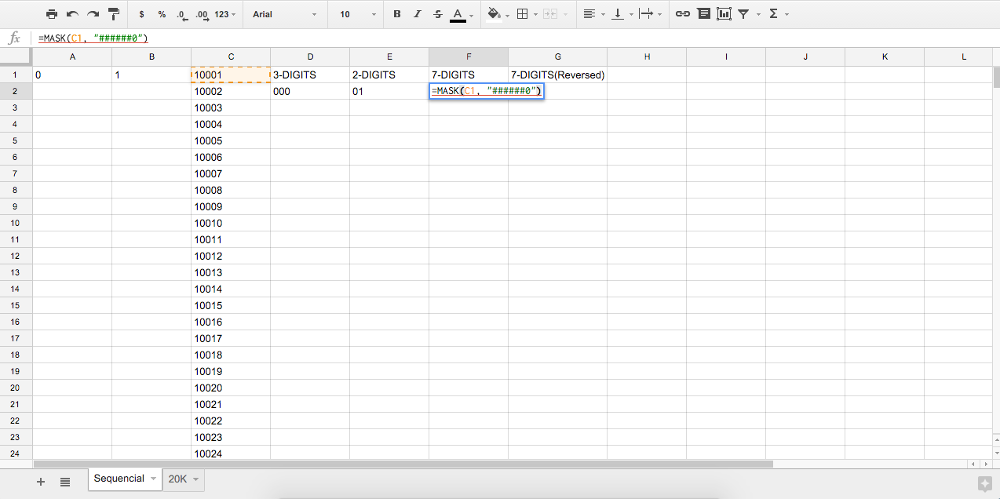
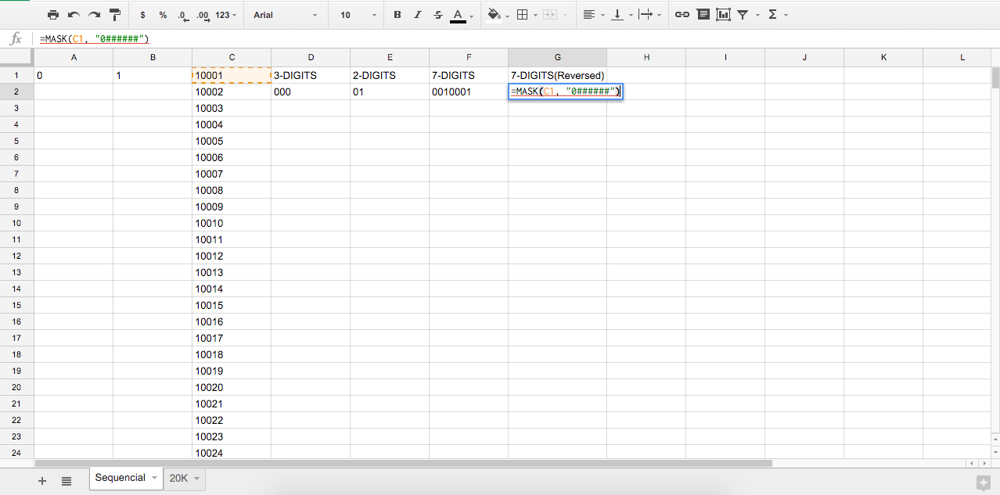

# gs4gsheets
>Conjunto de funciones comunes para Google Spreadsheets

## Numbers

### mask(number, format)

##### number
Tipo: `number`

##### pattern
Tipo: `string`  
Por defecto: `''`

Devuelve un numero entero formateado segun una mascara especificada. La mascara determina el flujo, u orden, del numero(normal/inverso) y la cantidad de digitos a devolver.

## Uso
Mascara de 7 digitos en orden normal

Mascara de 7 digitos en orden inverso

