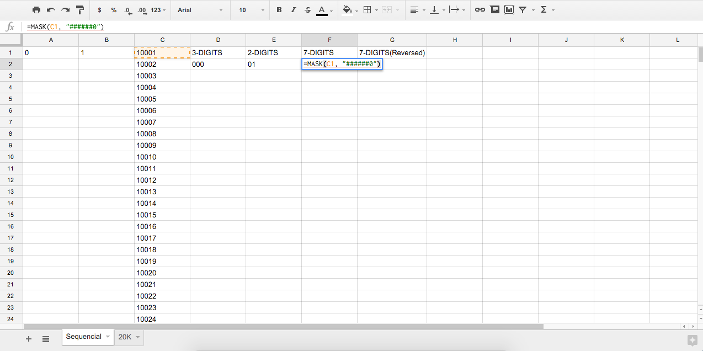
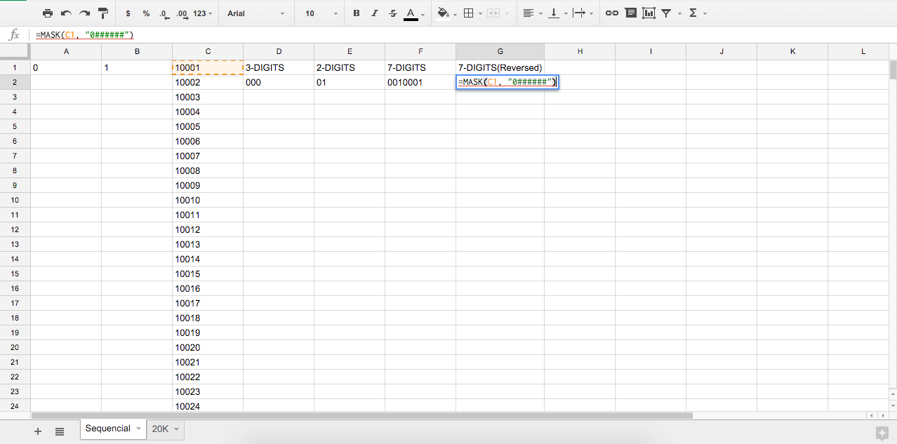

# fn-googlesheets
> Nuestras funciones para Google Spreadsheets

## Formato Numerico

### mask(numbers[, format])

#### numbers
Tipo: `number`

#### format
Tipo: `string`  
Por defecto: `''`

Devuelve un numero entero formateado segun la mascara especificada.  
La mascara determina el orden del numero(tambien inverso) y, la cantidad de digitos a devolver.

##### Uso
Mascara de 7 digitos en orden normal.

Mascara de 7 digitos en orden inverso.

MIT © 2015